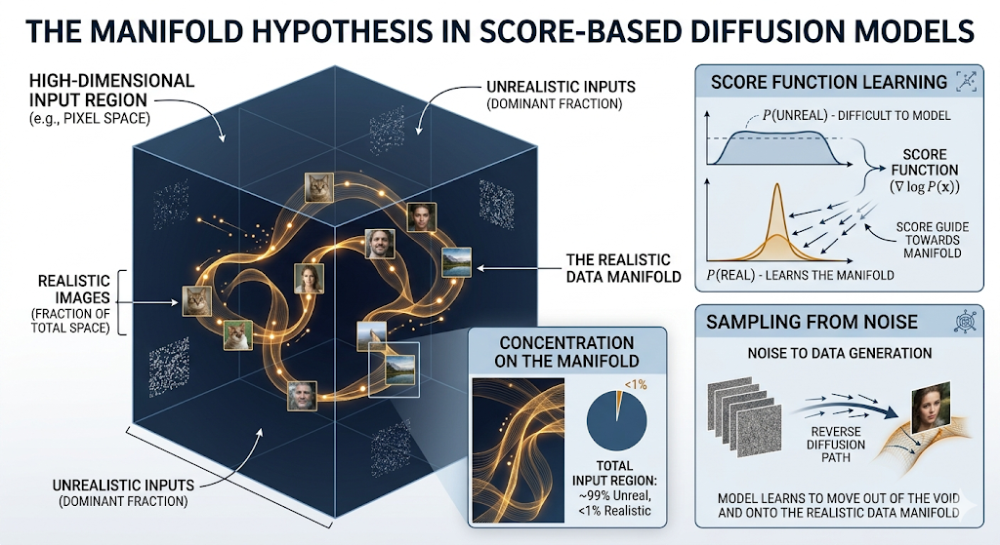
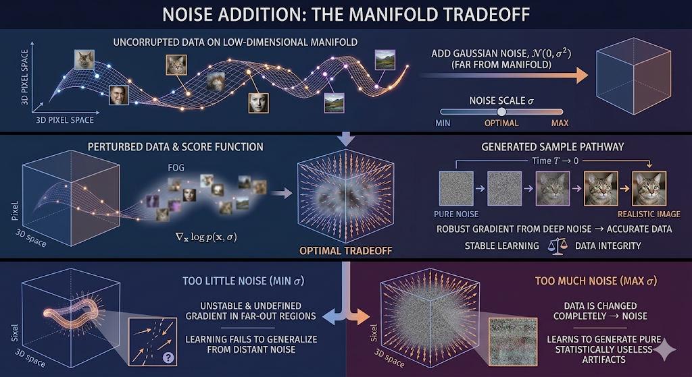

# I Thought I Understood Diffusion Models — Until I Tried Explaining Them

-------

I learnt scored based diffusion models a little over a month ago , and honestly thought that I had understood how they work. However after say a week or two I tried to explain the same thing to someone . And then a thought came up in my mind , perhaps I **haven't** understood them well. So here is my attempt to try to explain score based diffusion models , to deeply and intuitively understand it. 

## Introduction  

### What even is score???  

To understand what a score is , we must understand energy based models. Energy Based Models (EBMs) assign a scalar to each vector in the input space , they learn a function (E(X)) such that real data is assigned low energy and un-realistic data is assigned a high value of energy.  

Via this Energy function we can model a probability distribution on the input space such that , regions of high probability corresponds to realistic data . 
 

$$
p(x) = \frac{e^{-E(x)}}{Z}
$$

We can't calculate this because we would need Z (normalising factor) , for that we would have to integrate over many many dimensions . Which is a computationally expensive operation. 
 

Instead of learning the energy function , we learn the gradient of the log probability
 
$$
\nabla \log(p(x)) = \nabla(-E(x) - \log(z)) = \nabla(-E(x))
$$

Z is a constant and hence we dont need to worry about that. If we learn $\nabla \log(p(x))$ that means we learn $\nabla (-E(x))$ with that we can take a random point in the input space and iteratively move it to a lower energy level and hence a higher probabily region.  

This ***$\nabla \log(p(x))$*** is called the **score**. 

## Training Score Matching Models 

### Training Objective 

From the name it's pretty clear what our objective would be 
$$
\mathbb{E}_{p(x)} \left[ \| s_\theta(x) - \nabla_x \log p(x) \|^2 \right]
$$

However we can't use this because we dont know p(x) (probability distribution of the data)

$$
\mathbb{E}_{p(x)} \left[
    \frac{1}{2} \| s_\theta(x) \|^2 + \nabla \cdot s_\theta(x)
\right]
$$
    
This is derived using integration by parts (Hyvärinen score matching), which removes dependence on the unknown density.

However this has two issues :

1. $\nabla \cdot s_\theta(x)$ requires us to calculate the jacobian which is expensive for many dimensions 
2. Low coverage of the data space. 
   

#### Addressing Issues

1. **Low Data Coverage** :

If you have a $1024 \times 1024$ pixel image, the "input space" has over a million dimensions. However, the set of all "realistic images" doesn't fill that space; it forms a thin, winding "surface" (the manifold).

(*Image generated by gemini)

##### <u>The Manifold Hypothesis</u>

----

At it's core it suggests that high dimensional data roughly lies on a low dimensional space in the input space. 
For example: 

Say we have data points in 3D lying roughly on the surface of a sphere such that there is only a tiny bit of variance along the radial direction. Now to uniquely identify any point in the space we would require 3 coordinates r  , $\theta$ , $\phi$ . 
Since there exists little variance along the radial direction , we approximate it to a single value for all the data points. 
Then we would only require  $\theta$ , $\phi$ to uniquely represent a point in the input space. And hence a 3D structure formed by the data points actually lies on a low dimensional space , the  $\theta$ , $\phi$ space.

 

Now Images (1024 x 1024) too lie on a low dimensional space (as per the hypothesis) however they are ofcourse more complicated than a simple 2D space. 
 

Because the data is so concentrated into a tiny fraction of the input space it becomes difficult for the model to output a good enough prediction for the score (the gradient of the log space). Imagine trying to climb up a mountain but you start 500km from it's base and everything around you is flat. It would be difficult for you to predict the direction of the steepest ascent. 

#### <u> The solution </u>

Add noise to the data (Gaussian , with mean 0 and standard deviation sigma). However there is a tradeoff with that , add a lot of noise and it's easier for the model to learn gradient even far out of the "real world data" region . But the data isn't the same as before , it has changed complelely. Add too little sigma and the data remains mostly intact but the learning is unstable in the far out regions. 

(*Image generated by gemini)

In reality the model isnt trained with one particular sigma , it is trained on multiple sigmas . Initally with big values of sigma , with that the model learns the gradient pointing towards big "Global" structures (the rough outline of a human face , the shape of the head etc.). With the small values of sigma the model learns the gradient pointing towards "small minute details" of the image (details on a person's skin for example).  

$$
\tilde{x} = x + \sigma \epsilon,\quad \epsilon \sim \mathcal{N}(0, I)
$$

The final objective function we arrive at is

$$\mathcal{L}(\theta; \{\sigma_i\}_{i=1}^L) = \frac{1}{L} \sum_{i=1}^L \lambda(\sigma_i) \mathbb{E}_{p_{data}(\mathbf{x})} \mathbb{E}_{p_{\sigma_i}(\tilde{\mathbf{x}}|\mathbf{x})} \left[ \| s_{\theta}(\tilde{\mathbf{x}}, \sigma_i) - \nabla_{\tilde{\mathbf{x}}} \log p_{\sigma_i}(\tilde{\mathbf{x}}|\mathbf{x}) \|_2^2 \right]$$

$$\nabla_{\tilde{\mathbf{x}}} \log p_{\sigma_i}(\tilde{\mathbf{x}}|\mathbf{x}) = -\frac{\tilde{\mathbf{x}} - \mathbf{x}}{\sigma_i^2}$$

$$\mathcal{L}(\theta) = \sum_{i=1}^L \sigma_i^2 \, \mathbb{E}_{p_{data}(\mathbf{x})} \mathbb{E}_{p_{\sigma_i}(\tilde{\mathbf{x}}|\mathbf{x})} \left[ \left\| s_{\theta}(\tilde{\mathbf{x}}, \sigma_i) + \frac{\tilde{\mathbf{x}} - \mathbf{x}}{\sigma_i^2} \right\|_2^2 \right]$$

Score-based models learn a hierarchy of vector fields (score functions) conditioned on noise scales $\sigma$. By perturbing the data, we ensure these fields cover the entire input space, overcoming the low-density problem of the manifold. To generate data, we perform Langevin Dynamics, starting from pure noise and following the vectors down the noise scales until samples concentrate around the realistic data manifold.
    

Notice we need not to calculate the jacobian here now , that also solves the 1st problem. 

### Sampling 

We sample from the model using Langevin dynamics by starting from a random point say x0,
and iteratively updating it using the gradient of the log-density along with properly scaled noise. The gradient term drives the sample toward high-probability regions (exploitation), while the noise term enables exploration of the space. In practice, especially in annealed or diffusion-based variants, the noise level is higher when the sample is in low-density or highly uncertain regions, encouraging exploration, and is reduced as the sample approaches high-density regions, allowing the dynamics to refine and concentrate around the modes.

$$
x_{t+1} = x_{t} + \epsilon.s_{\theta}+noise 
$$

## A Small Toy Score Based Diffusion Model 

Here is a fairly simple implementation of the core ideas of score based diffusion models
We don't generate high quality images though , we instead generate 2d points. This overall shows the both forward and backward process of diffusion models. 

Honestly seeing this really helped me understand how score based diffusion models work in principle under the hood . 

Here the curve in red is our manifold , this is where our "real data" lives. 
Governed by the parametric coordinates : $(\sin(t)\cos(t) , \sin(t))$ where-in t is a parameter going from 0 to 2pi. Again following the Manifold Hypothesis , a lower dimensional 1D manifold. 
 
If the true data lies exactly on a low-dimensional manifold, the underlying distribution is singular (like a Dirac delta), making it impossible to directly learn its log-density or score. Diffusion models address this by adding Gaussian noise, effectively transforming the data distribution into a family of smooth densities 	​
 
The model is trained to learn the score of these smoothed distributions rather than the original one. During sampling, we start from a simple distribution and iteratively use these learned score functions (with decreasing noise levels) to move samples toward regions of high probability. As a result, the model generates samples that concentrate around the manifold, rather than exactly on it.

## Conclusion 

So, did I actually understand diffusion models?

I think the answer is: *partially*.

Before this, I understood the mechanics — how to add noise, how to train a model, how to sample. But what I was missing was a clearer picture of *what the model is really learning*.

It is not learning the true data distribution directly. Instead, it learns a family of smoother distributions obtained by perturbing the data with noise. These smoothed distributions are well-behaved, have meaningful gradients everywhere, and are therefore learnable. Sampling then becomes a gradual refinement process — starting from pure noise and using these learned score fields to move toward regions where the data is likely to exist.

The most important realization for me was this:

> Diffusion models do not generate data by memorizing it — they generate it by learning how to **transform noise into structure**.

Even in the simple 2D example, you can see this clearly: points do not jump directly onto the manifold, but are gradually guided toward it.

And that, I think, is the essence of score-based diffusion models.

